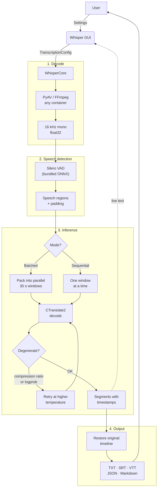
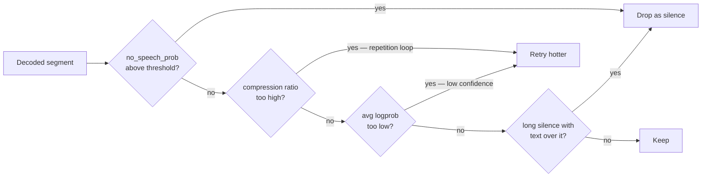

<div align="center">

# 🎙️ Whisper Unified

**Offline-first desktop GUI for local speech-to-text transcription**

[](https://www.python.org/)
[](https://github.com/SYSTRAN/faster-whisper)
[](LICENSE)
[](https://www.microsoft.com/)

[🇺🇦 Українська](README.uk.md) · [🇷🇺 Русский](README.ru.md) · [🇬🇧 English](#)

</div>

---

## ✨ Features

- **100% offline** — no API keys, no internet required after the model is converted
- **faster-whisper (CTranslate2)** — around 60× realtime on a 16 GB consumer GPU; a 2 h 52 m recording transcribes in about 2.5 minutes
- **Reads what your meetings actually produce** — `m4a`, `mp4`, `webm`, `mkv`, `opus` and more, via bundled FFmpeg. No system install needed
- **Silero VAD** — bundled with the engine; skips silence, which is both faster and less prone to hallucinated text
- **GPU / CPU** — CUDA acceleration with an automatic CPU fallback if the GPU cannot be brought up
- **Batch processing** — point it at a folder and walk away
- **Five output formats** — TXT, SRT, VTT, JSON with timings and quality metrics, and a Markdown meeting protocol
- **Bilingual UI** — English and Russian, switchable in one click
- **3 presets** — Fast · Accurate · Noisy audio
- **Vocabulary hint** — seed the decoder with attendee names and jargon so it spells them correctly
- **Persistent settings** — restored next launch from `~/.whisper_gui/settings.json`
- **Field validation** — out-of-range numbers turn red and block Start with an explanation
- **Error banner & per-file ETA** — "File 2/5 — ETA 0:42" above the tabs, no need to open Logs
- **Stop is safe** — stopping mid-file writes a `.partial` transcript instead of discarding the work
- **Hotkeys** — `F5` start, `Esc` stop, `Ctrl+O` audio folder, `Ctrl+L` logs, `Ctrl+Q` quit
- **Result preview & quick open** — read the latest transcript in a popup, or jump to the output folder
- **Drag & drop** (optional) — install `windnd` and drop a file or folder onto the audio path
- **WER / CER evaluation** — built-in script to measure transcription quality
- **Headless CLI** — `transcribe_cli.py` for batch jobs and scripting

---

## 🖥️ Requirements

| Component | Minimum |
|-----------|---------|
| OS | Windows 10 / 11 |
| Python | 3.10 or newer (developed on 3.12) |
| RAM | 8 GB |
| GPU | NVIDIA GPU, CUDA 12 *(recommended)* |
| VRAM | 2 GB for `whisper-medium`, 4 GB+ for `large` |
| Storage | ~1.5 GB per converted model, plus ~2.3 GB for the environment |

> **CPU-only mode works** and is selected automatically when no GPU is available, but expect it to be many times slower on long recordings.

CUDA does **not** need a system-wide toolkit install: the required cuBLAS and cuDNN
libraries come from pip wheels (`requirements-gpu.txt`) and are wired up at startup
by `whisper_engine/cuda_dlls.py`.

---

## ⚡ Quick Start

### 1. Clone the repository

```bash
git clone https://github.com/Anim-2022/Whisper.git
cd Whisper
```

### 2. Create a virtual environment

```bash
python -m venv .venv
.venv\Scripts\activate
```

### 3. Install dependencies

There are four requirements files, each with a distinct job:

| File | When you need it |
|------|------------------|
| `requirements.txt` | Always — the runtime |
| `requirements-gpu.txt` | For CUDA acceleration (cuBLAS + cuDNN wheels) |
| `requirements-convert.txt` | Once, to convert models. Pulls in torch and transformers |
| `requirements-dev.txt` | Only to run the tests and linter |

```bash
pip install -r requirements.txt -r requirements-gpu.txt
```

### 4. Get a model and convert it

The engine uses CTranslate2 format, not HuggingFace safetensors. Download a
Whisper model from Hugging Face into `models/`, then convert it once:

```bash
pip install -r requirements-convert.txt
python tools/convert_models.py
```

This scans `models/models--*/snapshots/*`, writes converted models to
`models/ct2/<name>/`, and runs entirely offline against the weights you already
have. Check what it found first with `python tools/convert_models.py --list`.

`whisper-medium` is the recommended default — see [Choosing a model](#-choosing-a-model).

> Conversion copies `tokenizer.json` and `preprocessor_config.json` alongside the
> weights. Both matter: without the first, the engine silently reaches out to the
> network; without the second, a 128-mel model such as `large-v3` decodes as 80 mel
> bins and quietly produces garbage. The converter refuses to proceed without them.

Once converted, the original `models--*` folders are only needed if you want to
re-convert, and can be deleted to reclaim disk space.

### 5. Launch

```bash
Start_Whisper.bat        # double-click or run in terminal
# or
python start_gui.py
```

Or headless:

```bash
python transcribe_cli.py audio/ --formats txt,md --out audio_to_text
```

---

## 📁 Project Structure

```
Whisper/
├── whisper_engine/          # Engine package
│   ├── engine.py            #   faster-whisper adapter (the only faster_whisper import)
│   ├── config.py            #   TranscriptionConfig
│   ├── models.py            #   local CT2 model discovery and validation
│   ├── audio.py             #   PyAV decoding, format list
│   ├── writers.py           #   TXT / SRT / VTT / JSON / Markdown
│   ├── progress.py          #   the single owner of every status string
│   ├── timestamps.py        #   subtitle timestamp formatting
│   ├── types.py             #   TranscriptResult / TranscriptSegment
│   ├── device.py            #   CUDA probing without torch
│   └── cuda_dlls.py         #   Windows CUDA DLL discovery
├── whisper_core.py          # Batch orchestration over the engine
├── whisper_gui.py           # CustomTkinter GUI (EN/RU bilingual)
├── gui/                     # GUI package: constants, i18n, settings, widgets
├── start_gui.py             # Entry point
├── transcribe_cli.py        # Headless runner
├── tools/convert_models.py  # One-time HF → CTranslate2 conversion
├── evaluate_transcriptions.py  # WER/CER evaluation tool
├── tests/                   # pytest suite (no GPU or weights required)
├── models/ct2/              # ← Converted models go here (not in repo)
├── audio/                   # ← Default input folder (not in repo)
└── audio_to_text/           # ← Default output folder (not in repo)
```

---

## 🏗 Architecture & Logic

### Pipeline Overview



Timestamps are mapped back to the original timeline after VAD, so progress
reporting and subtitle timings stay correct even though silence was removed
before decoding.

### Batched vs Sequential

| | 🚀 Batched *(default)* | 🎯 Sequential |
| :--- | :--- | :--- |
| **Speed** | Several times faster; packs many 30 s windows into one GPU call | Roughly a quarter of the speed |
| **Segment length** | One segment per 30 s window | Sentence-level |
| **Subtitles** | Cues are ~30 s — fine as a transcript, unusable as subtitles | Proper subtitle timing |
| **Temperature fallback** | Not available | Retries degenerate output at higher temperature |
| **Previous-text context** | Not available | Optional, improves consistency |
| **Hallucination filter** | Not available | Drops text invented over long silences |

The application does not pretend otherwise: selecting a batched mode together
with a sequential-only option raises a warning banner and the option is cleared,
rather than silently having no effect.

### Guards against degenerate output

Long recordings are where Whisper misbehaves — repetition loops, and text
invented over silence. Four independent guards apply:



---

## 🎛️ Presets

| Preset | Mode | Best for |
|--------|------|----------|
| **Fast** | Batched, beam 1 | Drafts and quick passes over long archives |
| **Accurate** *(default)* | Batched, beam 5 | Everyday use. Fast enough that there is no real trade-off against Fast |
| **Noisy audio** | Sequential, beam 5 | Messy recordings, and anything where you need subtitle-grade timing |

---

## 🧠 Choosing a model

| Model | Notes |
|-------|-------|
| `whisper-medium` *(default)* | The recommended balance. Keeps punctuation and spells English technical terms correctly |
| `whisper-small` | Faster and lighter, less accurate on difficult speech |
| `whisper-large-v3` | Highest quality, heaviest |
| `whisper-large-v3-turbo` | Fastest, good for drafts. Distilled to four decoder layers: it loses punctuation on long speech and tends to transliterate English terms rather than spell them |

> Measured on ~3 h of Russian lecture audio containing English technical terms,
> `medium` in batched mode matched or beat the previous transformers-based engine
> on punctuation density while retaining more English terms — and ran 5.7× faster.
> `turbo` was faster still but produced one test file with no punctuation at all.

---

## ⚙️ Advanced Settings

All advanced parameters are accessible from the **Advanced** tab:

### Compute

| Parameter | Description |
|-----------|-------------|
| Device | `cuda` or `cpu` |
| Compute type | `auto` (float16 on GPU, int8 on CPU), `int8_float16` to halve VRAM, `float32` for debugging |
| Mode | Batched or sequential — see the comparison above |
| Batch size | 30 s windows decoded together. Lower this first on VRAM errors |

### Voice activity detection

| Parameter | Description |
|-----------|-------------|
| VAD threshold | Higher = more aggressive silence cutting |
| Min speech (ms) | Sounds shorter than this are not treated as speech |
| Min silence (ms) | How long a pause must be before speech is split there |
| Speech padding (ms) | Audio kept on both sides so syllables are not clipped |

### Decoding

| Parameter | Description |
|-----------|-------------|
| Beam size | 1 is fastest, 5 is the usual quality choice |
| Temperature fallback | Retry degenerate output at higher temperature *(sequential only)* |
| Previous-text context | Improves consistency, classic cause of repetition loops *(sequential only)* |
| Word timestamps | Per-word timings in the JSON output |
| No-speech threshold | Above this probability a segment is dropped as silence |
| Compression ratio limit | Text compressing better than this is a repetition loop |
| Log-probability threshold | Low-confidence segments are retried |
| Hallucination filter (sec) | Drops text over silences longer than this *(sequential only)* |

---

## 📄 Output Formats

| Format | Contents |
|--------|----------|
| **TXT** | Plain transcript, split into paragraphs on pauses longer than 2 s |
| **SRT** | Standard subtitles, `HH:MM:SS,mmm` |
| **VTT** | WebVTT subtitles, `HH:MM:SS.mmm` |
| **JSON** | Full structured output — see below |
| **Markdown** | Readable meeting protocol: metadata table, then 5-minute sections with timestamps |

The JSON schema (`whisper-unified/transcript`, version 1):

```json
{
  "schema": "whisper-unified/transcript",
  "schema_version": 1,
  "source": { "file": "meeting.m4a", "duration_sec": 10289.0, "duration_after_vad_sec": 8134.2 },
  "model": { "id": "whisper-medium", "engine": "faster-whisper", "engine_version": "1.2.1",
             "device": "cuda", "compute_type": "float16" },
  "language": { "code": "ru", "probability": 0.998, "auto_detected": false },
  "options": { "batched": true, "beam_size": 5, "vad_filter": true, "...": "..." },
  "created_at": "2026-08-16T21:14:05+02:00",
  "stopped_early": false,
  "segments": [
    { "id": 1, "start": 0.0, "end": 4.32, "text": "…",
      "no_speech_prob": 0.02, "avg_logprob": -0.21,
      "compression_ratio": 1.42, "temperature": 0.0 }
  ],
  "text": "full concatenated transcript"
}
```

The per-segment quality metrics are there so a bad run can be diagnosed after the
fact: a high `no_speech_prob` next to confident-looking text is the signature of a
hallucination over silence, and a `compression_ratio` above ~2.4 marks a
repetition loop. `words` appears only when word timestamps are enabled.

---

## 📊 Evaluating Transcription Quality

Compare predicted transcripts against reference texts:

```bash
python evaluate_transcriptions.py --pred-dir audio_to_text/ --ref-dir path/to/reference_texts/
```

Output:

```
File                                     WER      CER
------------------------------------------------------------
interview_01.txt                      5.200%   2.100%
lecture_02.txt                        8.700%   3.400%
------------------------------------------------------------
Average                               6.950%   2.750%
```

> Reference `.txt` files must have **the same filename** as the corresponding prediction files.

---

## 🔧 Supported Audio Formats

`wav` · `mp3` · `flac` · `ogg` · `opus` · `m4a` · `mp4` · `aac` · `wma` · `webm` ·
`mkv` · `mov` · `avi` · `aiff` · `amr` · `3gp`

Decoding goes through PyAV, which bundles FFmpeg — video containers work too, and
the audio track is extracted automatically. No system FFmpeg install is required.

---

## 🧪 Development

```bash
pip install -r requirements.txt -r requirements-dev.txt
pytest
ruff check .
```

The test suite runs without a GPU or any model weights: the engine is injected,
so the whole per-file loop is exercised against a stub. CI runs on Linux and
Windows.

---

## 🤝 Contributing

Pull requests are welcome! For major changes, please open an issue first to discuss what you would like to change.

---

## 📄 License

[MIT](LICENSE) © 2026 Anim-2022
