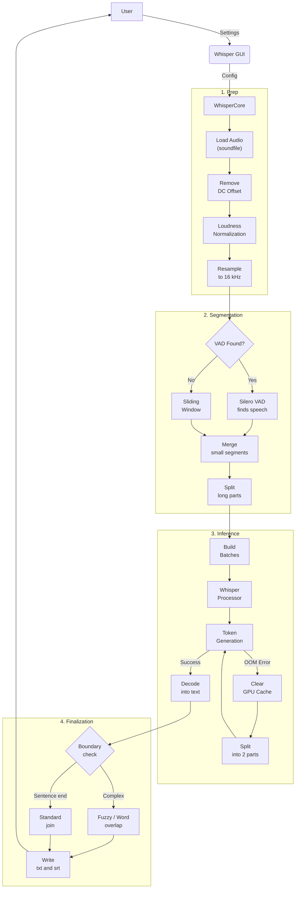
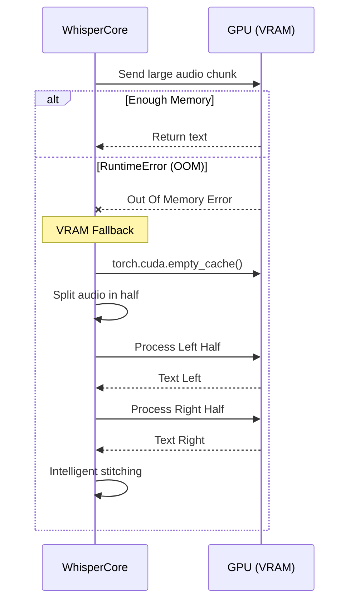

<div align="center">

# 🎙️ Whisper Unified

**Offline-first desktop GUI for local speech-to-text transcription**

[](https://www.python.org/)
[](LICENSE)
[](https://www.microsoft.com/)

[🇷🇺 Русский](README.ru.md) · [🇬🇧 English](#)

</div>

---

## ✨ Features

- **100% offline** — no API keys, no internet required after model download
- **Silero VAD** — intelligent voice activity detection skips silence automatically
- **GPU / CPU support** — CUDA acceleration for NVIDIA GPUs, CPU fallback included
- **Batch processing** — drop a whole folder of audio files and process them all at once
- **SRT subtitle output** — optional timestamped subtitle files alongside plain text
- **Bilingual UI** — switch between English and Russian in one click
- **3 presets** — Fast · Accurate · Noisy audio, covering everyday use cases
- **WER / CER evaluation** — built-in script to measure transcription quality

---

## 🖥️ Requirements

| Component | Minimum |
|-----------|---------|
| OS | Windows 10 / 11 |
| Python | 3.10 or newer |
| RAM | 8 GB |
| GPU | NVIDIA GPU with CUDA 12.4 *(recommended)* |
| VRAM | 4 GB for `whisper-medium`, 10 GB+ for `large` |
| Storage | ~3 GB per Whisper model |

> **CPU-only mode works**, but is significantly slower — expect 5–10× longer processing times.

---

## ⚡ Quick Start

### 1. Clone the repository

```bash
git clone https://github.com/Anim-2022/Whisper.git
cd Whisper
```

### 2. Create a virtual environment

```bash
python -m venv .venv
.venv\Scripts\activate
```

### 3. Install dependencies

```bash
pip install -r requirements.txt
```

> PyTorch with CUDA 12.4 is pulled automatically via the extra index URL already set in `requirements.txt`.

### 4. Download a Whisper model

Download from [Hugging Face — openai/whisper-medium](https://huggingface.co/openai/whisper-medium) and place it under:

```
models/
└── models--openai--whisper-medium/
    ├── refs/
    └── snapshots/
        └── <hash>/          ← model files go here
```

Alternatively, on first run the app will show you the expected path in the **Model** section.

### 5. (Optional) Download Silero VAD

```bash
git clone https://github.com/snakers4/silero-vad.git models/silero-vad
```

VAD greatly improves segmentation quality. Without it the app falls back to a simple sliding window.

### 6. Launch

```bash
Start_Whisper.bat        # double-click or run in terminal
# or
python start_gui.py
```

---

## 📁 Project Structure

```
Whisper/
├── whisper_core.py          # Core engine: VAD, segmentation, batching, OOM handling
├── whisper_gui.py           # CustomTkinter GUI (EN/RU bilingual)
├── start_gui.py             # Entry point
├── evaluate_transcriptions.py  # WER/CER evaluation tool
├── Start_Whisper.bat        # Windows launcher
├── requirements.txt         # Python dependencies
├── models/                  # ← Put Whisper + Silero VAD models here (not in repo)
├── audio/                   # ← Default input folder (not in repo)
└── audio_to_text/           # ← Default output folder (not in repo)
```

---

## 🏗 Architecture & Logic

### Pipeline Overview



### Segmentation Comparison

| Feature | 🚀 Silero VAD (Recommended) | 🪟 Sliding Window (Fallback) |
| :--- | :--- | :--- |
| **Method** | Neural network detects voice and extracts only speech segments | Strict mathematical chunking (e.g. 20s each) |
| **Silence handling** | Ignored, which saves VRAM and time | Passed to Whisper, risk of model hallucinations |
| **Boundary stitching**| Rarely needed, since phrases are extracted intact | Requires Overlap to avoid cutting words in half |
| **Timestamp accuracy**| Highest: `.srt` line starts precisely with voice | Average: tied to strict chunk boundaries |
| **Resource usage**| Adaptive (depends on the actual sentence length) | Strictly fixed by chunk size |

### Out-of-Memory (OOM) Safe-Fallback

Implemented via recursive `transcribe_chunk_safe()`.



---

## 🎛️ Presets

| Preset | Best for |
|--------|----------|
| **Fast** *(default)* | Everyday offline transcription, balanced speed and quality |
| **Accurate** | When wording matters more than speed; uses beam search |
| **Noisy audio** | Messy recordings with background noise or fragmented speech |

---

## ⚙️ Advanced Settings

All advanced parameters are accessible from the **Advanced** tab:

| Parameter | Description |
|-----------|-------------|
| Device | `cuda` / `cpu` / `mps` compute target |
| Precision | `float16` (GPU, faster) or `float32` (CPU, safer) |
| Batch size | Chunks processed in parallel — lower if you get VRAM errors |
| VAD threshold | Higher = more aggressive silence cutting |
| Decode profile | `balanced` or `quality` (beam search, slower) |
| Target dB | Audio normalization level before transcription |
| Merge gap | Maximum pause (seconds) to merge adjacent VAD segments |
| Min silence | Minimum silence (ms) for VAD to split a segment |
| Chunk sec | Fallback chunk length when VAD is off |
| Overlap sec | Overlap between chunks to prevent word boundary cuts |
| Max new tokens | Token limit per chunk — lower reduces hallucinations |

---

## 📊 Evaluating Transcription Quality

Compare predicted transcripts against reference texts:

```bash
python evaluate_transcriptions.py \
    --pred-dir audio_to_text/ \
    --ref-dir  path/to/reference_texts/
```

Output:

```
File                                     WER      CER
------------------------------------------------------------
interview_01.txt                      5.200%   2.100%
lecture_02.txt                        8.700%   3.400%
------------------------------------------------------------
Average                               6.950%   2.750%
```

> Reference `.txt` files must have **the same filename** as the corresponding prediction files.

---

## 🔧 Supported Audio Formats

`wav` · `flac` · `mp3` · `ogg` · `m4a` · `opus` · `wma` and any format readable by `soundfile` / `librosa`.

---

## 🤝 Contributing

Pull requests are welcome! For major changes, please open an issue first to discuss what you would like to change.

---

## 📄 License

[MIT](LICENSE) © 2026 Anim-2022
