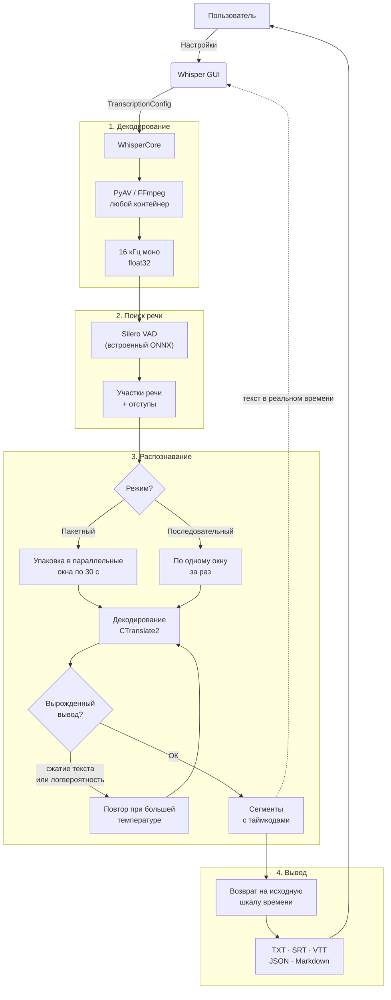
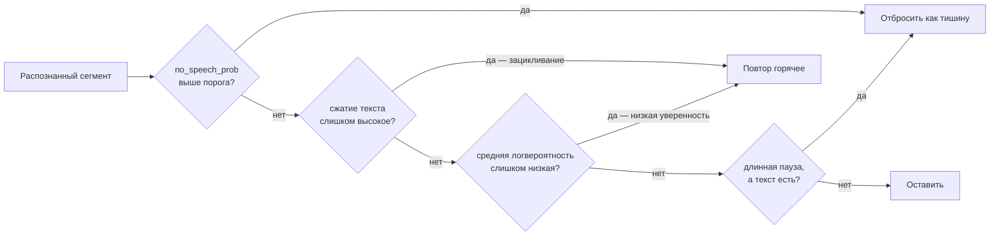

<div align="center">

# 🎙️ Whisper Unified

**Офлайн-приложение с графическим интерфейсом для локальной расшифровки речи**

[](https://www.python.org/)
[](https://github.com/SYSTRAN/faster-whisper)
[](LICENSE)
[](https://www.microsoft.com/)

[🇺🇦 Українська](README.uk.md) · [🇷🇺 Русский](#) · [🇬🇧 English](README.md)

</div>

---

## ✨ Возможности

- **100% офлайн** — никаких API-ключей. Сеть нужна ровно один раз, чтобы получить модель
- **faster-whisper (CTranslate2)** — 16–26× быстрее реального времени на профиле по умолчанию (видеокарта 16 ГБ) и 53–60× на профиле для длинных записей, который превращает файл 2 ч 52 мин примерно в 2,5 минуты
- **Читает то, что реально выдают ваши совещания** — `m4a`, `mp4`, `webm`, `mkv`, `opus` и другие, через встроенный FFmpeg. Ставить в систему ничего не нужно
- **Silero VAD** — входит в состав движка; пропускает тишину, что и быстрее, и снижает риск выдуманного текста
- **GPU / CPU** — ускорение на CUDA с автоматическим откатом на CPU, если видеокарту поднять не удалось
- **Пакетная обработка** — укажите папку и займитесь своими делами
- **Пять форматов вывода** — TXT, SRT, VTT, JSON с таймингами и метриками качества, а также протокол встречи в Markdown
- **Двуязычный интерфейс** — русский и английский, переключение одним кликом
- **3 профиля** — Встреча · Длинная запись · Сложное аудио, каждый подобран замерами
- **Подсказка со словарём** — задайте имена участников и термины, чтобы модель писала их правильно
- **Сохранение настроек** — восстанавливаются при следующем запуске из `~/.whisper_gui/settings.json`
- **Проверка полей** — значения вне диапазона подсвечиваются красным и блокируют старт с пояснением
- **Баннер ошибок и ETA по файлам** — «Файл 2/5 — ETA 0:42» над вкладками, открывать логи не нужно
- **Безопасная остановка** — при остановке посреди файла сохраняется частичный транскрипт `.partial`, а не пустота
- **Горячие клавиши** — `F5` старт, `Esc` стоп, `Ctrl+O` папка аудио, `Ctrl+L` логи, `Ctrl+Q` выход
- **Просмотр результата** — прочитать последний транскрипт во всплывающем окне или открыть папку вывода
- **Drag & drop** (необязательно) — установите `windnd` и перетаскивайте файл или папку на поле пути
- **Оценка WER / CER** — встроенный скрипт для измерения качества расшифровки
- **CLI без интерфейса** — `transcribe_cli.py` для пакетных задач и скриптов

---

## 🖥️ Требования

| Компонент | Минимум |
|-----------|---------|
| ОС | Windows 10 / 11 |
| Python | 3.11 или новее (CI проверяет 3.12) |
| ОЗУ | 8 ГБ |
| Видеокарта | NVIDIA, CUDA 12 *(рекомендуется)* |
| Видеопамять | 2 ГБ для `whisper-medium`, 4 ГБ+ для `large` |
| Диск | ~1,5 ГБ на сконвертированную модель плюс ~2,3 ГБ на окружение |

> **Режим только на CPU работает** и выбирается автоматически при отсутствии видеокарты, но на длинных записях он кратно медленнее.

Для CUDA **не нужен** системный toolkit: необходимые библиотеки cuBLAS и cuDNN
приходят из pip-пакетов (`requirements-gpu.txt`) и подключаются при старте
модулем `whisper_engine/cuda_dlls.py`.

---

## ⚡ Быстрый старт

Четыре команды от чистой машины до готовой расшифровки. Если что-то не пойдёт —
раздел [Если что-то не работает](#-если-что-то-не-работает) описывает реальные случаи.

### 1. Получите код

```bash
git clone https://github.com/Anim-2022/Whisper.git
cd Whisper
```

### 2. Создайте виртуальное окружение

```bash
python -m venv .venv
.venv\Scripts\activate
```

В PowerShell команда другая — `.venv\Scripts\Activate.ps1`; на Linux и macOS —
`source .venv/bin/activate`. В начале строки должно появиться `(.venv)`.

Нужен Python 3.11 или новее — проверьте командой `python --version`.

### 3. Установите зависимости

```bash
pip install -r requirements.txt
```

Если есть видеокарта NVIDIA, добавьте ускорение. Это необязательно: без него всё
работает, просто медленнее:

```bash
pip install -r requirements-gpu.txt
```

### 4. Скачайте модель

```bash
python tools/download_model.py
```

Команда загрузит `whisper-medium` (~1,5 ГБ) — рекомендуемую модель — в
`models/ct2/`. Она уже в том формате, который использует движок, поэтому
конвертировать ничего не нужно и torch не устанавливается.

Другие варианты покажет `python tools/download_model.py --list`, конкретную
модель можно назвать прямо: `python tools/download_model.py small`.

> **Это единственный шаг, которому нужен интернет.** Как только модель на диске,
> приложение больше никогда не обращается к сети — загрузка идёт с `local_files_only`.

### 5. Запустите

```bash
Start_Whisper.bat
```

или без интерфейса:

```bash
python transcribe_cli.py путь/к/аудио --formats txt,md
```

В окне: укажите папку с записями, выберите язык, нажмите **Старт**. Расшифровки
появятся в `audio_to_text/`.

<details>
<summary><b>Уже есть веса Whisper от HuggingFace на диске?</b></summary>

Тогда их можно сконвертировать самостоятельно вместо скачивания — вся установка
останется офлайн. Это единственный случай, когда нужны torch и transformers:

```bash
pip install -r requirements-convert.txt
python tools/convert_models.py --list     # посмотреть, что найдено
python tools/convert_models.py            # сконвертировать всё
```

Инструмент ищет раскладку кэша HuggingFace — `models/models--<org>--<имя>/snapshots/<хеш>/`,
именно её создаёт `huggingface-cli download openai/whisper-medium --cache-dir models`.
Результат пишется в `models/ct2/<имя>/`.

При конвертации рядом с весами копируются `tokenizer.json` и
`preprocessor_config.json`, без них инструмент откажется работать. Оба важны: без
первого движок молча полезет в сеть, без второго модель со 128 мел-каналами
(например `large-v3`) будет декодироваться как 80-канальная и тихо выдавать чушь.

После конвертации исходные папки `models--*` нужны только для повторной
конвертации, их можно удалить.

</details>

### Четыре файла зависимостей

| Файл | Когда |
|------|-------|
| `requirements.txt` | Всегда — это рантайм |
| `requirements-gpu.txt` | Ускорение на NVIDIA (cuBLAS + cuDNN) |
| `requirements-convert.txt` | Только для конвертации собственных весов HuggingFace |
| `requirements-dev.txt` | Только для запуска тестов и линтера |

---

## 🩺 Если что-то не работает

**`Could not open requirements file: requirements.txt`**
Вы не в папке проекта. Перейдите в склонированный каталог `Whisper` — команда
`dir` должна показывать `requirements.txt`.

**`No models installed yet` или пустой список моделей**
Выполните `python tools/download_model.py`. Кнопка «Обновить» рядом с полем
модели пересканирует `models/ct2/` без перезапуска приложения.

**`python` не распознаётся или показывает 3.10 и старше**
Установите Python 3.11+ с python.org, отметив галочку «Add Python to PATH», и
пересоздайте окружение: `py -3.12 -m venv .venv`.

**Считает на процессоре, хотя видеокарта NVIDIA есть**
Установите `requirements-gpu.txt`. Вкладка «Логи» показывает, какие каталоги CUDA
подключились при старте, и прямо сообщает об откате на процессор.

**`Library cublas64_12.dll is not found`**
Та же причина — не хватает библиотек CUDA. `pip install -r requirements-gpu.txt`.

**Работает очень медленно**
Посмотрите во вкладке «Логи», не стоит ли `cpu` в строке модели. На процессоре
длинная запись считается в разы дольше: установите GPU-зависимости либо выберите
модель поменьше.

**Не хватает видеопамяти**
Уменьшите **Размер батча** на вкладке «Расширенные» или поставьте **Тип
вычислений** в `int8_float16` — это примерно вдвое снижает расход памяти.

---

## 📁 Структура проекта

```
Whisper/
├── whisper_engine/          # Пакет движка
│   ├── engine.py            #   адаптер faster-whisper (единственный импорт faster_whisper)
│   ├── config.py            #   TranscriptionConfig
│   ├── models.py            #   поиск и проверка локальных CT2-моделей
│   ├── audio.py             #   декодирование через PyAV, список форматов
│   ├── writers.py           #   TXT / SRT / VTT / JSON / Markdown
│   ├── progress.py          #   единственный владелец всех строк статуса
│   ├── timestamps.py        #   форматирование таймкодов субтитров
│   ├── types.py             #   TranscriptResult / TranscriptSegment
│   ├── device.py            #   определение CUDA без torch
│   └── cuda_dlls.py         #   поиск CUDA-DLL под Windows
├── whisper_core.py          # Пакетная оркестровка поверх движка
├── whisper_gui.py           # Интерфейс на CustomTkinter (RU/EN)
├── gui/                     # Пакет интерфейса: константы, i18n, настройки, виджеты
├── start_gui.py             # Точка входа
├── transcribe_cli.py        # Запуск без интерфейса
├── tools/download_model.py  # Скачивание готовой модели (простой путь)
├── tools/convert_models.py  # Разовая конвертация HF → CTranslate2
├── evaluate_transcriptions.py  # Инструмент оценки WER/CER
├── tests/                   # Набор pytest (не требует GPU и весов)
├── models/ct2/              # ← Сюда попадают сконвертированные модели (нет в репозитории)
├── audio/                   # ← Папка входных файлов по умолчанию (нет в репозитории)
└── audio_to_text/           # ← Папка результатов по умолчанию (нет в репозитории)
```

---

## 🏗 Архитектура и логика

### Обзор конвейера



После VAD таймкоды возвращаются на исходную шкалу времени, поэтому прогресс и
тайминги субтитров остаются верными, хотя тишина была вырезана до распознавания.

### Пакетный режим против последовательного

| | 🚀 Пакетный *(по умолчанию)* | 🎯 Последовательный |
| :--- | :--- | :--- |
| **Скорость** | В разы быстрее: много 30-секундных окон в одном вызове GPU | Примерно вчетверо медленнее |
| **Длина сегмента** | Один сегмент на 30-секундное окно | На уровне предложения |
| **Субтитры** | Реплики по ~30 с — годятся как текст, но не как субтитры | Нормальные тайминги субтитров |
| **Лестница температур** | Недоступна | Повторяет вырожденный вывод при большей температуре |
| **Контекст предыдущего текста** | Недоступен | Опционально, улучшает связность |
| **Фильтр галлюцинаций** | Недоступен | Убирает текст, выдуманный на длинных паузах |

Приложение не делает вид, что это не так: если выбрать пакетный режим вместе с
опцией, доступной только последовательному, появляется предупреждение и опция
сбрасывается — вместо того чтобы молча не работать.

### Защита от вырожденного вывода

Именно на длинных записях Whisper ведёт себя плохо — зацикливается и придумывает
текст на месте тишины. Работают четыре независимых предохранителя:



---

## 🎛️ Профили

| Профиль | Режим | Скорость | Для чего |
|---------|-------|----------|----------|
| **Встреча** *(по умолчанию)* | Последовательный, луч 5 | 16–26× | Повседневная работа. Самый полный текст и сегменты 3–5 с, поэтому один прогон годится и как расшифровка, и как субтитры |
| **Длинная запись** | Пакетный, луч 5 | 53–60× | Многочасовые архивы. Расплата — сегменты по 30 с, непригодные для субтитров, и отдельные слова, теряющиеся на стыке окон |
| **Сложное аудио** | Последовательный, луч 5 | 15–25× | Тихие помещения, микрофон вдалеке. Вытягивает на ~4 % больше текста, сохраняя слабую речь |

Значения подобраны замерами, а не интуицией. Комментарии над `PRESETS` в
`gui/constants.py` фиксируют, что именно измерялось и — не менее полезно — какие
параметры были опробованы и отвергнуты, потому что ничего не меняли.

---

## 🧠 Выбор модели

| Модель | Комментарий |
|--------|-------------|
| `whisper-medium` *(по умолчанию)* | Рекомендуемый баланс. Сохраняет пунктуацию и правильно пишет английские технические термины |
| `whisper-small` | Быстрее и легче, менее точна на сложной речи |
| `whisper-large-v3` | Максимальное качество, самая тяжёлая |
| `whisper-large-v3-turbo` | Самая быстрая, годится для черновика. Дистиллирована до четырёх слоёв декодера: на длинной речи теряет пунктуацию и склонна транслитерировать английские термины вместо правильного написания |

> На примерно 3 часах русской лекционной записи с английскими техническими
> терминами `medium` в пакетном режиме сравнялся или превзошёл прежний движок на
> transformers по плотности пунктуации и удержал больше английских терминов —
> при этом работая в 5,7 раза быстрее. `turbo` был ещё быстрее, но на одном из
> тестовых файлов выдал текст вообще без пунктуации.

---

## ⚙️ Расширенные настройки

Все расширенные параметры доступны на вкладке **Расширенные**:

### Вычисления

| Параметр | Описание |
|----------|----------|
| Устройство | `cuda` или `cpu` |
| Тип вычислений | `auto` (float16 на GPU, int8 на CPU), `int8_float16` вдвое снижает расход видеопамяти, `float32` для отладки |
| Режим | Пакетный или последовательный — см. сравнение выше |
| Размер батча | Сколько 30-секундных окон декодируется вместе. При ошибках памяти уменьшайте в первую очередь |

### Детектор речи

| Параметр | Описание |
|----------|----------|
| Порог VAD | Выше — агрессивнее вырезается тишина |
| Мин. речь (мс) | Звуки короче не считаются речью |
| Мин. тишина (мс) | Насколько длинной должна быть пауза, чтобы речь разрезалась |
| Отступ речи (мс) | Аудио с обеих сторон, чтобы не срезались слоги |

### Декодирование

| Параметр | Описание |
|----------|----------|
| Ширина луча | 1 — самый быстрый, 5 — обычный выбор для качества |
| Лестница температур | Повтор вырожденного вывода при большей температуре *(только последовательный)* |
| Контекст предыдущего текста | Улучшает связность, классическая причина зацикливания *(только последовательный)* |
| Тайминги по словам | Пословные тайминги в выводе JSON |
| Порог «не речь» | Выше этой вероятности сегмент отбрасывается как тишина |
| Предел сжатия текста | Текст, сжимающийся лучше этого, — зацикливание |
| Порог логвероятности | Сегменты с низкой уверенностью распознаются заново |
| Фильтр галлюцинаций (сек) | Убирает текст на паузах длиннее указанной *(только последовательный)* |

---

## 📄 Форматы вывода

| Формат | Содержимое |
|--------|------------|
| **TXT** | Обычный текст, разбитый на абзацы по паузам длиннее 2 с |
| **SRT** | Стандартные субтитры, `ЧЧ:ММ:СС,ммм` |
| **VTT** | Субтитры WebVTT, `ЧЧ:ММ:СС.ммм` |
| **JSON** | Полный структурированный вывод — см. ниже |
| **Markdown** | Читаемый протокол встречи: таблица метаданных, затем пятиминутные разделы с отметками времени |

Схема JSON (`whisper-unified/transcript`, версия 1):

```json
{
  "schema": "whisper-unified/transcript",
  "schema_version": 1,
  "source": { "file": "meeting.m4a", "duration_sec": 10289.0, "duration_after_vad_sec": 8134.2 },
  "model": { "id": "whisper-medium", "engine": "faster-whisper", "engine_version": "1.2.1",
             "device": "cuda", "compute_type": "float16" },
  "language": { "code": "ru", "probability": 0.998, "auto_detected": false },
  "options": { "batched": true, "beam_size": 5, "vad_filter": true, "...": "..." },
  "created_at": "2026-08-16T21:14:05+02:00",
  "stopped_early": false,
  "segments": [
    { "id": 1, "start": 0.0, "end": 4.32, "text": "…",
      "no_speech_prob": 0.02, "avg_logprob": -0.21,
      "compression_ratio": 1.42, "temperature": 0.0 }
  ],
  "text": "полный склеенный транскрипт"
}
```

Метрики качества по каждому сегменту нужны, чтобы разобрать неудачный прогон
задним числом: высокий `no_speech_prob` рядом с уверенно выглядящим текстом —
признак галлюцинации на тишине, а `compression_ratio` выше ~2,4 отмечает
зацикливание. Ключ `words` появляется только при включённых пословных таймингах.

---

## 📊 Оценка качества расшифровки

Сравните полученные транскрипты с эталонными текстами:

```bash
python evaluate_transcriptions.py --pred-dir audio_to_text/ --ref-dir path/to/reference_texts/
```

Вывод:

```
File                                     WER      CER
------------------------------------------------------------
interview_01.txt                      5.200%   2.100%
lecture_02.txt                        8.700%   3.400%
------------------------------------------------------------
Average                               6.950%   2.750%
```

> Эталонные файлы `.txt` должны иметь **то же имя**, что и соответствующие файлы результатов.

---

## 🔧 Поддерживаемые форматы аудио

`wav` · `mp3` · `flac` · `ogg` · `opus` · `m4a` · `mp4` · `aac` · `wma` · `webm` ·
`mkv` · `mov` · `avi` · `aiff` · `amr` · `3gp`

Декодирование идёт через PyAV со встроенным FFmpeg — видеоконтейнеры тоже
работают, звуковая дорожка извлекается автоматически. Устанавливать FFmpeg в
систему не требуется.

---

## 🧪 Разработка

```bash
pip install -r requirements.txt -r requirements-dev.txt
pytest
ruff check .
```

Набор тестов работает без видеокарты и без весов моделей: движок подставляется
через внедрение зависимости, поэтому весь пофайловый цикл проверяется на
заглушке. CI выполняется на Linux и Windows.

---

## 🤝 Участие в разработке

Pull request'ы приветствуются! Для крупных изменений сначала откройте issue, чтобы обсудить предлагаемые правки.

---

## 📄 Лицензия

[MIT](LICENSE) © 2026 Anim-2022
