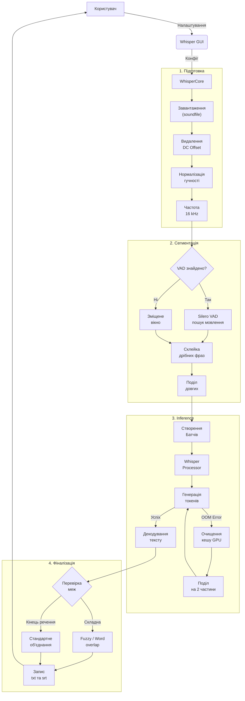
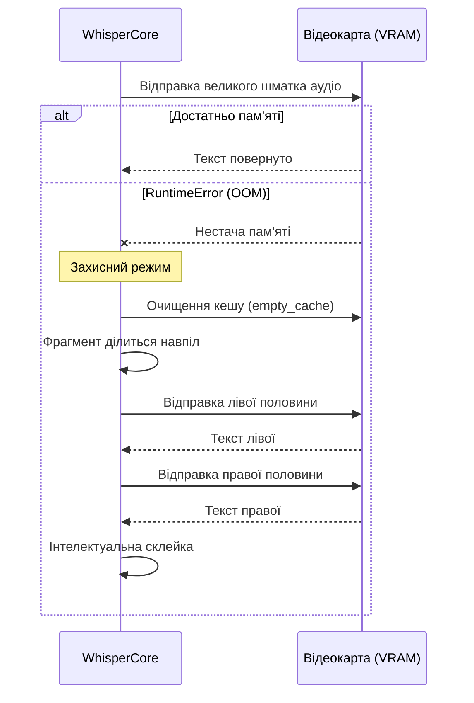

<div align="center">

# 🎙️ Whisper Unified

**Локальний десктопний GUI-додаток для транскрибування мовлення в текст**

[](https://www.python.org/)
[](LICENSE)
[](https://www.microsoft.com/)

[🇺🇦 Українська](#) · [🇷🇺 Русский](README.ru.md) · [🇬🇧 English](README.md)

</div>

---

## ✨ Можливості

- **100% офлайн** — жодних API-ключів та інтернету після завантаження моделей
- **Silero VAD** — розумне визначення активності голосу, автоматично пропускає тишу
- **Підтримка GPU / CPU** — прискорення CUDA для відеокарт NVIDIA, а також робота на процесорі
- **Пакетна обробка** — закиньте цілу папку з аудіофайлами, і програма обробить їх усі
- **Експорт в SRT** — опціональне створення файлів субтитрів із таймкодами разом зі звичайним текстом
- **Двомовний інтерфейс** — перемикання між обраними мовами в один клік
- **3 профілі** — Швидкий · Точний · Зашумлене аудіо (покривають більшість завдань)
- **Збереження налаштувань** — остання папка, модель, профіль, тема та змінені поля відновлюються при наступному запуску (`~/.whisper_gui/settings.json`)
- **Валідація полів** — вихід за допустимий діапазон підсвічується червоним і блокує Старт із поясненням
- **Банер помилок та ETA по файлах** — проблеми та «Файл 2/5 — залишилось 0:42» видно над вкладками, відкривати вкладку Логи не потрібно
- **Гарячі клавіші** — `F5` старт, `Esc` стоп, `Ctrl+O` папка з аудіо, `Ctrl+L` вкладка Логи, `Ctrl+Q` вихід
- **Перегляд результату та швидке відкриття** — кнопки в сайдбарі відкривають папку результатів або останній транскрипт у вікні (копіювати / зберегти як)
- **Drag & drop** (опційно) — встановіть `windnd` і перетягуйте файл або папку на поле «Папка з аудіо»
- **Оцінка WER / CER** — вбудований скрипт для вимірювання точності транскрибування

---

## 🖥️ Системні вимоги

| Компонент | Мінімум |
|-----------|---------|
| ОС | Windows 10 / 11 |
| Python | 3.10 або новіший |
| ОЗП | 8 ГБ |
| Відеокарта | Відеокарта NVIDIA з підтримкою CUDA 12.4 *(рекомендовано)* |
| Відеопам'ять| 4 ГБ для `whisper-medium`, 10+ ГБ для `large` |
| Місце | ~3 ГБ на кожну модель Whisper |

> **Режим роботи лише на процесорі (CPU-only) підтримується**, але працює значно повільніше — очікуйте збільшення часу обробки у 5–10 разів.

---

## ⚡ Швидкий старт

### 1. Клонування репозиторію

```bash
git clone https://github.com/Anim-2022/Whisper.git
cd Whisper
```

### 2. Створення віртуального середовища

```bash
python -m venv .venv
.venv\Scripts\activate
```

### 3. Встановлення залежностей

```bash
pip install -r requirements.txt
```

> PyTorch із CUDA 12.4 завантажується автоматично за посиланням, вказаним у `requirements.txt`.

### 4. Завантаження моделі Whisper

Завантажте модель із [Hugging Face — openai/whisper-medium](https://huggingface.co/openai/whisper-medium) та помістіть її до:

```
models/
└── models--openai--whisper-medium/
    ├── refs/
    └── snapshots/
        └── <hash>/          ← файли моделі сюди
```

Або при першому запуску програма покаже очікуваний шлях у розділі **Модель**.

### 5. (Опціонально) Завантаження Silero VAD

```bash
git clone https://github.com/snakers4/silero-vad.git models/silero-vad
```

VAD значно покращує якість сегментації. Без нього програма використовує просту нарізку зміщенним вікном.

### 6. Запуск

```bash
Start_Whisper.bat        # подвійний клік або запуск у терміналі
# або
python start_gui.py
```

---

## 📁 Структура проєкту

```
Whisper/
├── whisper_core.py          # Ядро: VAD, сегментація, батчінг, обробка нестачі пам'яті (OOM)
├── whisper_gui.py           # GUI на CustomTkinter 
├── start_gui.py             # Точка входу
├── evaluate_transcriptions.py  # Інструмент оцінки WER/CER
├── Start_Whisper.bat        # Launcher для Windows
├── requirements.txt         # Залежності Python
├── models/                  # ← Сюди класти моделі Whisper + Silero VAD (не комітяться)
├── audio/                   # ← Папка для вхідних файлів за замовчуванням (не комітиться)
└── audio_to_text/           # ← Папка для результатів за замовчуванням (не комітиться)
```

---

## 🏗 Архітектура та логіка роботи

### Конвеєр обробки (Pipeline)



### Різниця механізмів сегментації

| Параметр | 🚀 Silero VAD (Основний режим) | 🪟 Зміщене вікно (Резервний) |
| :--- | :--- | :--- |
| **Принцип роботи** | Нейромережа детектує голос і вирізує лише фрази | Жорстка математична нарізка (по N секунд) |
| **Обробка тиші** | Ігнорується, що економить відеопам'ять (VRAM) та час | Передається у Whisper, модель може галюцинувати |
| **Склейка на межах**| Не потрібна, оскільки фраза вирізується цілком | Потребує перекриття (Overlap), щоб не розрізати слово |
| **Точність таймкодів**| Найвища: у `.srt` рядок з перших звуків | Середня: залежить від жорстких меж чанка |
| **Споживання ресурсів**| Адаптивне (залежить від реальної довжини речення) | Суворо фіксоване |

### Механізм захисту від нестачі пам'яті (OOM Safe-Fallback)

Якщо відеокарта не справляється із розміром чанка, програма не вилітає, а динамічно дробить задачу.



---

## 🎛️ Профілі

| Профіль | Для чого підходить |
|--------|----------|
| **Швидкий** *(за замовчуванням)* | Щоденна офлайн-транскрибація, баланс швидкості та якості |
| **Точний** | Коли точність слів важливіша за швидкість; використовує beam search |
| **Зашумлене аудіо** | Проблемні записи з фоновим шумом або розірваним мовленням |

---

## ⚙️ Розширені налаштування

Всі розширені параметри доступні на вкладці **Розширені**:

| Параметр | Опис |
|-----------|-------------|
| Пристрій | `cuda` / `cpu` / `mps` для обчислень |
| Точність | `float16` (GPU, швидше) або `float32` (CPU, безпечніше) |
| Розмір батча | Чанки, що обробляються паралельно. Зменште, якщо не вистачає пам'яті |
| Поріг VAD | Що вище, тим агресивніше вирізається тиша (і випадкові звуки) |
| Профіль декодування | `balanced` або `quality` (beam search, повільніше) |
| Цільовий dB | Рівень нормалізації гучності перед транскрибацією |
| Склейка паузи | Макс. пауза (сек) для об'єднання сусідніх сегментів VAD |
| Мін. тиша | Мін. тиша (мс) для того, щоб VAD розділив сегмент |
| Довжина чанка (сек)| Резервна довжина чанка, якщо VAD відключено |
| Перекриття (сек)| Перекриття чанків для запобігання обрізанню слів на межах |
| Макс. нових токенів| Ліміт токенів на чанк. Менше — менше галюцинацій |

---

## 📊 Оцінка якості транскрибування

Порівняйте отриманий текст з еталонним (reference):

```bash
python evaluate_transcriptions.py \
    --pred-dir audio_to_text/ \
    --ref-dir  path/to/reference_texts/
```

Вивід:

```
File                                     WER      CER
------------------------------------------------------------
interview_01.txt                      5.200%   2.100%
lecture_02.txt                        8.700%   3.400%
------------------------------------------------------------
Average                               6.950%   2.750%
```

> Еталонні `.txt` файли повинні мати **такі самі імена**, як і файли з передбаченнями.

---

## 🔧 Підтримувані аудіоформати

`wav` · `flac` · `mp3` · `ogg` · `m4a` · `opus` · `wma` та будь-які формати, що підтримуються `soundfile` / `librosa`.

---

## 🤝 Внесок у проєкт

Пул-реквести вітаються! Для великих змін, будь ласка, спочатку створіть issue, щоб обговорити, що ви хотіли б змінити.

---

## 📄 Ліцензія

[MIT](LICENSE) © 2026 Anim-2022
