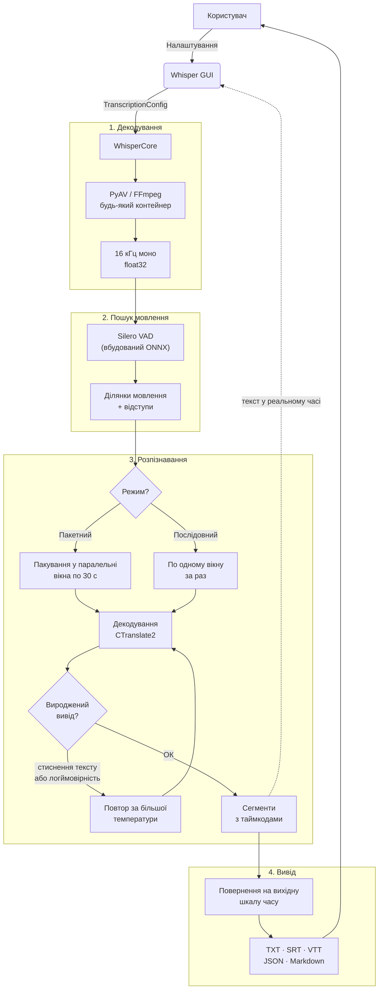
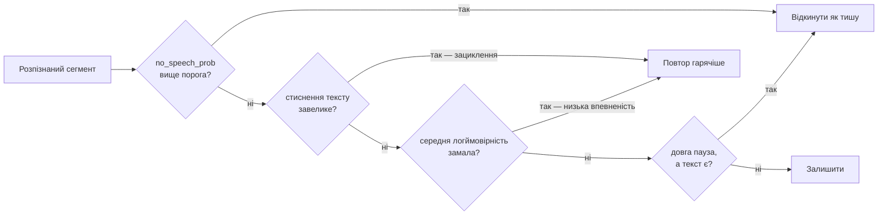

<div align="center">

# 🎙️ Whisper Unified

**Офлайн-застосунок із графічним інтерфейсом для локальної розшифровки мовлення**

[](https://www.python.org/)
[](https://github.com/SYSTRAN/faster-whisper)
[](LICENSE)
[](https://www.microsoft.com/)

[🇺🇦 Українська](#) · [🇷🇺 Русский](README.ru.md) · [🇬🇧 English](README.md)

</div>

---

## ✨ Можливості

- **100% офлайн** — ані API-ключів, ані інтернету після конвертації моделі
- **faster-whisper (CTranslate2)** — близько 60× швидше за реальний час на споживчій відеокарті з 16 ГБ; запис тривалістю 2 год 52 хв розшифровується приблизно за 2,5 хвилини
- **Читає те, що справді видають ваші наради** — `m4a`, `mp4`, `webm`, `mkv`, `opus` та інші, через вбудований FFmpeg. Встановлювати в систему нічого не потрібно
- **Silero VAD** — входить до складу рушія; пропускає тишу, що і швидше, і знижує ризик вигаданого тексту
- **GPU / CPU** — прискорення на CUDA з автоматичним відкотом на CPU, якщо відеокарту підняти не вдалося
- **Пакетна обробка** — вкажіть теку й займіться своїми справами
- **П'ять форматів виводу** — TXT, SRT, VTT, JSON із таймінгами та метриками якості, а також протокол зустрічі у Markdown
- **Двомовний інтерфейс** — англійська та російська, перемикання одним кліком
- **3 профілі** — Швидкий · Точний · Шумне аудіо
- **Підказка зі словником** — задайте імена учасників і терміни, щоб модель писала їх правильно
- **Збереження налаштувань** — відновлюються під час наступного запуску з `~/.whisper_gui/settings.json`
- **Перевірка полів** — значення поза діапазоном підсвічуються червоним і блокують старт із поясненням
- **Банер помилок та ETA за файлами** — «Файл 2/5 — ETA 0:42» над вкладками, відкривати логи не потрібно
- **Безпечна зупинка** — під час зупинки посеред файлу зберігається частковий транскрипт `.partial`, а не порожнеча
- **Гарячі клавіші** — `F5` старт, `Esc` стоп, `Ctrl+O` тека аудіо, `Ctrl+L` логи, `Ctrl+Q` вихід
- **Перегляд результату** — прочитати останній транскрипт у спливному вікні або відкрити теку виводу
- **Drag & drop** (необов'язково) — встановіть `windnd` і перетягуйте файл або теку на поле шляху
- **Оцінка WER / CER** — вбудований скрипт для вимірювання якості розшифровки
- **CLI без інтерфейсу** — `transcribe_cli.py` для пакетних задач і скриптів

---

## 🖥️ Вимоги

| Компонент | Мінімум |
|-----------|---------|
| ОС | Windows 10 / 11 |
| Python | 3.11 або новіше (CI перевіряє 3.12) |
| ОЗП | 8 ГБ |
| Відеокарта | NVIDIA, CUDA 12 *(рекомендовано)* |
| Відеопам'ять | 2 ГБ для `whisper-medium`, 4 ГБ+ для `large` |
| Диск | ~1,5 ГБ на сконвертовану модель плюс ~2,3 ГБ на середовище |

> **Режим лише на CPU працює** й обирається автоматично за відсутності відеокарти, але на довгих записах він у рази повільніший.

Для CUDA **не потрібен** системний toolkit: необхідні бібліотеки cuBLAS і cuDNN
надходять із pip-пакетів (`requirements-gpu.txt`) і підключаються під час старту
модулем `whisper_engine/cuda_dlls.py`.

---

## ⚡ Швидкий старт

### 1. Клонуйте репозиторій

```bash
git clone https://github.com/Anim-2022/Whisper.git
cd Whisper
```

### 2. Створіть віртуальне середовище

```bash
python -m venv .venv
.venv\Scripts\activate
```

### 3. Встановіть залежності

Файлів залежностей чотири, у кожного своє завдання:

| Файл | Коли потрібен |
|------|---------------|
| `requirements.txt` | Завжди — це рантайм |
| `requirements-gpu.txt` | Для прискорення на CUDA (пакети cuBLAS + cuDNN) |
| `requirements-convert.txt` | Один раз, для конвертації моделей. Тягне torch і transformers |
| `requirements-dev.txt` | Лише для запуску тестів і лінтера |

```bash
pip install -r requirements.txt -r requirements-gpu.txt
```

### 4. Завантажте модель і сконвертуйте її

Рушій працює з форматом CTranslate2, а не з safetensors від HuggingFace.
Завантажте модель Whisper з Hugging Face до теки `models/` й один раз сконвертуйте:

```bash
pip install -r requirements-convert.txt
python tools/convert_models.py
```

Скрипт переглядає `models/models--*/snapshots/*`, записує результат до
`models/ct2/<ім'я>/` і працює повністю офлайн із вже наявними у вас вагами.
Спершу подивіться, що він знайшов: `python tools/convert_models.py --list`.

`whisper-medium` — рекомендований варіант, див. [Вибір моделі](#-вибір-моделі).

> Під час конвертації поряд із вагами копіюються `tokenizer.json` та
> `preprocessor_config.json`. Обидва важливі: без першого рушій мовчки полізе в
> мережу, без другого модель зі 128 мел-каналами (наприклад `large-v3`) буде
> декодуватися як 80-канальна й тихо видавати сміття. Без них конвертер
> відмовиться працювати.

Після конвертації вихідні теки `models--*` потрібні лише для повторної
конвертації — їх можна видалити та звільнити місце.

### 5. Запуск

```bash
Start_Whisper.bat        # подвійний клік або запуск із термінала
# або
python start_gui.py
```

Або без інтерфейсу:

```bash
python transcribe_cli.py audio/ --formats txt,md --out audio_to_text
```

---

## 📁 Структура проєкту

```
Whisper/
├── whisper_engine/          # Пакет рушія
│   ├── engine.py            #   адаптер faster-whisper (єдиний імпорт faster_whisper)
│   ├── config.py            #   TranscriptionConfig
│   ├── models.py            #   пошук і перевірка локальних CT2-моделей
│   ├── audio.py             #   декодування через PyAV, список форматів
│   ├── writers.py           #   TXT / SRT / VTT / JSON / Markdown
│   ├── progress.py          #   єдиний власник усіх рядків статусу
│   ├── timestamps.py        #   форматування таймкодів субтитрів
│   ├── types.py             #   TranscriptResult / TranscriptSegment
│   ├── device.py            #   визначення CUDA без torch
│   └── cuda_dlls.py         #   пошук CUDA-DLL під Windows
├── whisper_core.py          # Пакетне оркестрування поверх рушія
├── whisper_gui.py           # Інтерфейс на CustomTkinter (EN/RU)
├── gui/                     # Пакет інтерфейсу: константи, i18n, налаштування, віджети
├── start_gui.py             # Точка входу
├── transcribe_cli.py        # Запуск без інтерфейсу
├── tools/convert_models.py  # Разова конвертація HF → CTranslate2
├── evaluate_transcriptions.py  # Інструмент оцінки WER/CER
├── tests/                   # Набір pytest (не потребує GPU і ваг)
├── models/ct2/              # ← Сюди потрапляють сконвертовані моделі (немає в репозиторії)
├── audio/                   # ← Тека вхідних файлів за замовчуванням (немає в репозиторії)
└── audio_to_text/           # ← Тека результатів за замовчуванням (немає в репозиторії)
```

---

## 🏗 Архітектура та логіка

### Огляд конвеєра



Після VAD таймкоди повертаються на вихідну шкалу часу, тому прогрес і таймінги
субтитрів залишаються правильними, хоча тишу було вирізано до розпізнавання.

### Пакетний режим проти послідовного

| | 🚀 Пакетний *(за замовчуванням)* | 🎯 Послідовний |
| :--- | :--- | :--- |
| **Швидкість** | У рази швидше: багато 30-секундних вікон в одному виклику GPU | Приблизно вчетверо повільніше |
| **Довжина сегмента** | Один сегмент на 30-секундне вікно | На рівні речення |
| **Субтитри** | Репліки по ~30 с — годяться як текст, але не як субтитри | Нормальні таймінги субтитрів |
| **Драбина температур** | Недоступна | Повторює вироджений вивід за більшої температури |
| **Контекст попереднього тексту** | Недоступний | Опційно, покращує зв'язність |
| **Фільтр галюцинацій** | Недоступний | Прибирає текст, вигаданий на довгих паузах |

Застосунок не вдає, що це не так: якщо обрати пакетний режим разом з опцією,
доступною лише послідовному, з'являється попередження й опція скидається —
замість того, щоб мовчки не працювати.

### Захист від виродженого виводу

Саме на довгих записах Whisper поводиться погано — зациклюється й вигадує текст
на місці тиші. Працюють чотири незалежні запобіжники:



---

## 🎛️ Профілі

| Профіль | Режим | Для чого |
|---------|-------|----------|
| **Швидкий** | Пакетний, промінь 1 | Чернетки та швидкий прохід великим архівом |
| **Точний** *(за замовчуванням)* | Пакетний, промінь 5 | Повсякденна робота. Настільки швидкий, що реального компромісу зі «Швидким» немає |
| **Шумне аудіо** | Послідовний, промінь 5 | Погані записи і все, де потрібні субтитри з нормальними таймінгами |

---

## 🧠 Вибір моделі

| Модель | Коментар |
|--------|----------|
| `whisper-medium` *(за замовчуванням)* | Рекомендований баланс. Зберігає пунктуацію й правильно пише англійські технічні терміни |
| `whisper-small` | Швидша й легша, менш точна на складному мовленні |
| `whisper-large-v3` | Максимальна якість, найважча |
| `whisper-large-v3-turbo` | Найшвидша, годиться для чернетки. Дистильована до чотирьох шарів декодера: на довгому мовленні втрачає пунктуацію і схильна транслітерувати англійські терміни замість правильного написання |

> На приблизно 3 годинах російського лекційного запису з англійськими технічними
> термінами `medium` у пакетному режимі зрівнявся або перевершив попередній рушій
> на transformers за щільністю пунктуації та втримав більше англійських термінів —
> при цьому працюючи у 5,7 раза швидше. `turbo` був іще швидшим, але на одному з
> тестових файлів видав текст узагалі без пунктуації.

---

## ⚙️ Розширені налаштування

Усі розширені параметри доступні на вкладці **Розширені**:

### Обчислення

| Параметр | Опис |
|----------|------|
| Пристрій | `cuda` або `cpu` |
| Тип обчислень | `auto` (float16 на GPU, int8 на CPU), `int8_float16` удвічі знижує витрату відеопам'яті, `float32` для налагодження |
| Режим | Пакетний або послідовний — див. порівняння вище |
| Розмір батчу | Скільки 30-секундних вікон декодується разом. За помилок пам'яті зменшуйте насамперед |

### Детектор мовлення

| Параметр | Опис |
|----------|------|
| Поріг VAD | Вище — агресивніше вирізається тиша |
| Мін. мовлення (мс) | Звуки коротші не вважаються мовленням |
| Мін. тиша (мс) | Наскільки довгою має бути пауза, щоб мовлення розрізалося |
| Відступ мовлення (мс) | Аудіо з обох боків, щоб не зрізалися склади |

### Декодування

| Параметр | Опис |
|----------|------|
| Ширина променя | 1 — найшвидший, 5 — звичайний вибір для якості |
| Драбина температур | Повтор виродженого виводу за більшої температури *(лише послідовний)* |
| Контекст попереднього тексту | Покращує зв'язність, класична причина зациклення *(лише послідовний)* |
| Таймінги за словами | Послівні таймінги у виводі JSON |
| Поріг «не мовлення» | Вище цієї ймовірності сегмент відкидається як тиша |
| Межа стиснення тексту | Текст, що стискається краще за це, — зациклення |
| Поріг логймовірності | Сегменти з низькою впевненістю розпізнаються заново |
| Фільтр галюцинацій (сек) | Прибирає текст на паузах, довших за вказану *(лише послідовний)* |

---

## 📄 Формати виводу

| Формат | Вміст |
|--------|-------|
| **TXT** | Звичайний текст, розбитий на абзаци за паузами, довшими за 2 с |
| **SRT** | Стандартні субтитри, `ГГ:ХХ:СС,ммм` |
| **VTT** | Субтитри WebVTT, `ГГ:ХХ:СС.ммм` |
| **JSON** | Повний структурований вивід — див. нижче |
| **Markdown** | Читабельний протокол зустрічі: таблиця метаданих, потім п'ятихвилинні розділи з відмітками часу |

Схема JSON (`whisper-unified/transcript`, версія 1):

```json
{
  "schema": "whisper-unified/transcript",
  "schema_version": 1,
  "source": { "file": "meeting.m4a", "duration_sec": 10289.0, "duration_after_vad_sec": 8134.2 },
  "model": { "id": "whisper-medium", "engine": "faster-whisper", "engine_version": "1.2.1",
             "device": "cuda", "compute_type": "float16" },
  "language": { "code": "ru", "probability": 0.998, "auto_detected": false },
  "options": { "batched": true, "beam_size": 5, "vad_filter": true, "...": "..." },
  "created_at": "2026-08-16T21:14:05+02:00",
  "stopped_early": false,
  "segments": [
    { "id": 1, "start": 0.0, "end": 4.32, "text": "…",
      "no_speech_prob": 0.02, "avg_logprob": -0.21,
      "compression_ratio": 1.42, "temperature": 0.0 }
  ],
  "text": "повний склеєний транскрипт"
}
```

Метрики якості за кожним сегментом потрібні, щоб розібрати невдалий прогін
заднім числом: високий `no_speech_prob` поряд із упевнено виглядаючим текстом —
ознака галюцинації на тиші, а `compression_ratio` вище ~2,4 позначає зациклення.
Ключ `words` з'являється лише за увімкнених послівних таймінгів.

---

## 📊 Оцінка якості розшифровки

Порівняйте отримані транскрипти з еталонними текстами:

```bash
python evaluate_transcriptions.py --pred-dir audio_to_text/ --ref-dir path/to/reference_texts/
```

Вивід:

```
File                                     WER      CER
------------------------------------------------------------
interview_01.txt                      5.200%   2.100%
lecture_02.txt                        8.700%   3.400%
------------------------------------------------------------
Average                               6.950%   2.750%
```

> Еталонні файли `.txt` мають мати **те саме ім'я**, що й відповідні файли результатів.

---

## 🔧 Підтримувані формати аудіо

`wav` · `mp3` · `flac` · `ogg` · `opus` · `m4a` · `mp4` · `aac` · `wma` · `webm` ·
`mkv` · `mov` · `avi` · `aiff` · `amr` · `3gp`

Декодування йде через PyAV із вбудованим FFmpeg — відеоконтейнери теж працюють,
звукова доріжка витягується автоматично. Встановлювати FFmpeg у систему не
потрібно.

---

## 🧪 Розробка

```bash
pip install -r requirements.txt -r requirements-dev.txt
pytest
ruff check .
```

Набір тестів працює без відеокарти й без ваг моделей: рушій підставляється через
впровадження залежності, тому весь пофайловий цикл перевіряється на заглушці.
CI виконується на Linux і Windows.

---

## 🤝 Участь у розробці

Pull request'и вітаються! Для великих змін спершу відкрийте issue, щоб обговорити запропоновані правки.

---

## 📄 Ліцензія

[MIT](LICENSE) © 2026 Anim-2022
